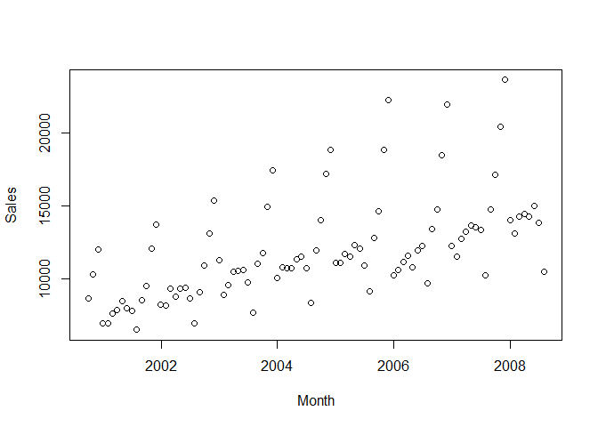
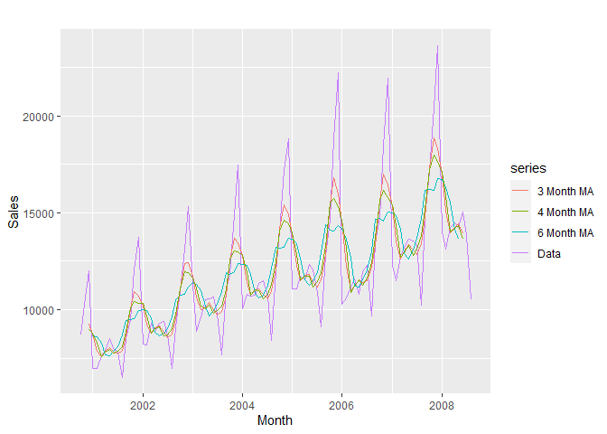
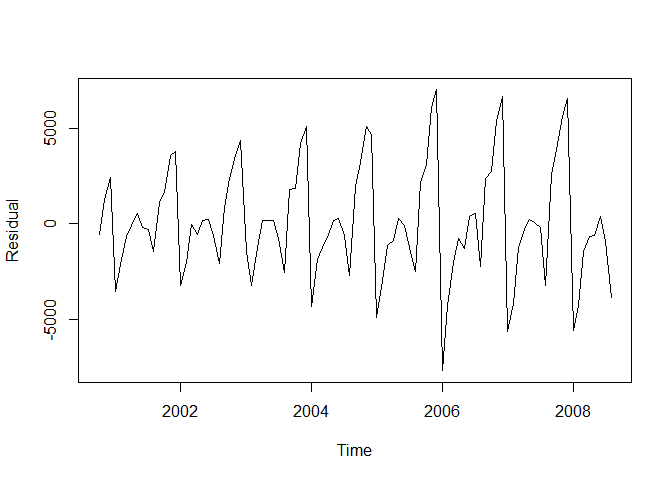
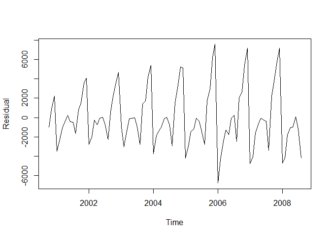
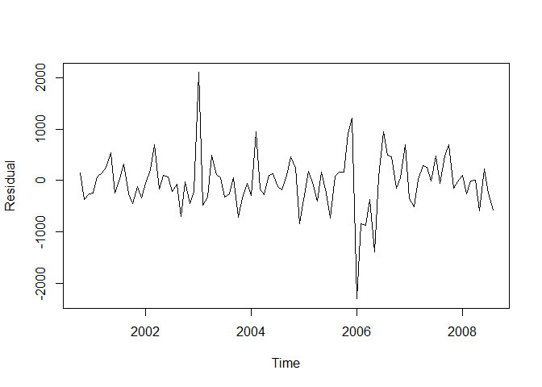
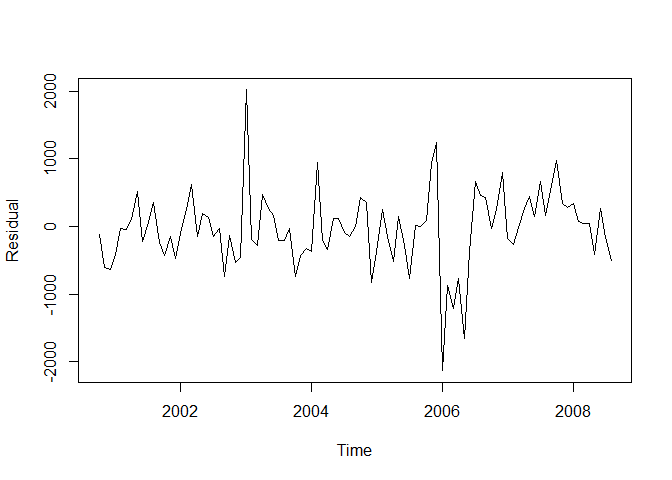

Production\_Planning\_of\_Wine-Northern\_Napa\_Valley\_Winery\_Inc.
================

*Importing Packages* **Sales Data**

``` r
library(car)
library(dplyr)
library(tidyverse)
library(psych)
library(caret)
library(fpp2)
library(forecast)
library(DescTools)
library(lubridate)
library(knitr)
library(rmarkdown)
library(readxl)


data <- read_excel("data.xlsx")
plot(data)
```

<!-- -->

*I chose data from October 2000 for two reasons.* *1) Grape harvest year
starts from October to September.* *2) Sales in December is much higher
than any other month. So, I considered sales of that month as an outlier
and since outlier affects any forecasting model, I removed all other
sales and started from Oct 2000 to get an accurate forecast.*

**linear Regression Model**

``` r
model1 <- lm(Sales ~ Month, data = data)
summary(model1)
```

    ## 
    ## Call:
    ## lm(formula = Sales ~ Month, data = data)
    ## 
    ## Residuals:
    ##     Min      1Q  Median      3Q     Max 
    ## -4912.1 -1368.8  -779.4   207.4  9151.6 
    ## 
    ## Coefficients:
    ##               Estimate Std. Error t value Pr(>|t|)    
    ## (Intercept) -1.898e+04  4.367e+03  -4.347 3.53e-05 ***
    ## Month        2.827e-05  3.983e-06   7.096 2.49e-10 ***
    ## ---
    ## Signif. codes:  0 '***' 0.001 '**' 0.01 '*' 0.05 '.' 0.1 ' ' 1
    ## 
    ## Residual standard error: 2800 on 93 degrees of freedom
    ## Multiple R-squared:  0.3513, Adjusted R-squared:  0.3443 
    ## F-statistic: 50.36 on 1 and 93 DF,  p-value: 2.491e-10

``` r
sales.lm <- predict(model1)
error <- data$Sales - sales.lm
rmse <- round(sqrt(mean(error^2)), digits = 2)
```

The RMSE for this model is 2769.88.

**Moving Average**

``` r
data.ts <- ts(data$Sales, start = c(2000, 10), frequency = 12, names = "sales")
autoplot(data.ts, series = "Data") + autolayer(ma(data.ts,4), series = "3 Month MA") + autolayer(ma(data.ts,7), series = "6 Month MA") + autolayer(ma(data.ts, 5), series = "4 Month MA") + xlab("Month") + ylab("Sales")
```

<!-- -->

*Moving average with span of 3,4, and 6*

``` r
ma3 <- ma(data.ts, 4)
sales.ma3 <- forecast(ma3)
error.ma3 <- data.ts - sales.ma3$fitted
rsme.ma3 <- round(sqrt(mean(error.ma3^2)), digits = 2)

ma4 <- ma(data.ts, 5)
sales.ma4 <- forecast(ma4)
error.ma4 <- data.ts - sales.ma4$fitted
rsme.ma4 <- round(sqrt(mean(error.ma4^2)), digits = 2)

ma6 <- ma(data.ts, 7)
sales.ma6 <- forecast(ma6)
error.ma6 <- data.ts - sales.ma6$fitted
rsme.ma6 <- round(sqrt(mean(error.ma6^2)), digits = 2)
```

The RMSE for 3 month ma is 1806.9, for 4 month ma is 2061.61, and for 6
month ma is 2481.12.

``` r
data.ts <- ts(data$Sales, start = c(2000, 10), frequency = 12, names = "sales")
autoplot(data.ts, main = "Wine Sales", xlab = "Year", ylab = "Sales (Cases of Wine)")
```

<!-- -->

**Simple Exponential Smoothing Method**

``` r
ses <- ses(data.ts, alpha = 0.399, h =13)
error.ses <- data.ts - ses$fitted
rmse.ses <- round(sqrt(mean(error.ses^2)), digits = 2)
x <- scales::percent(MAPE(ses$fitted, data.ts), accuracy = 0.01)
x1 <- MeanAD(ses$fitted)
x2 <- mean(error.ses^2)
plot(error.ses, ylab = "Residual")
```

<!-- -->

``` r
summary(ses)
```

    ## 
    ## Forecast method: Simple exponential smoothing
    ## 
    ## Model Information:
    ## Simple exponential smoothing 
    ## 
    ## Call:
    ##  ses(y = data.ts, h = 13, alpha = 0.399) 
    ## 
    ##   Smoothing parameters:
    ##     alpha = 0.399 
    ## 
    ##   Initial states:
    ##     l = 9255.0877 
    ## 
    ##   sigma:  2990.872
    ## 
    ##      AIC     AICc      BIC 
    ## 1955.228 1955.358 1960.336 
    ## 
    ## Error measures:
    ##                    ME     RMSE      MAE       MPE     MAPE     MASE     ACF1
    ## Training set 94.95237 2959.222 2248.456 -3.132211 18.29915 1.936836 0.311246
    ## 
    ## Forecasts:
    ##          Point Forecast    Lo 80    Hi 80    Lo 95    Hi 95
    ## Sep 2008       12854.26 9021.300 16687.21 6992.255 18716.26
    ## Oct 2008       12854.26 8727.458 16981.06 6542.863 19165.65
    ## Nov 2008       12854.26 8453.191 17255.32 6123.408 19585.11
    ## Dec 2008       12854.26 8195.041 17513.47 5728.602 19979.91
    ## Jan 2009       12854.26 7950.463 17758.05 5354.550 20353.96
    ## Feb 2009       12854.26 7717.516 17991.00 4998.289 20710.23
    ## Mar 2009       12854.26 7494.684 18213.83 4657.498 21051.02
    ## Apr 2009       12854.26 7280.754 18427.76 4330.320 21378.19
    ## May 2009       12854.26 7074.738 18633.78 4015.245 21693.27
    ## Jun 2009       12854.26 6875.816 18832.70 3711.021 21997.49
    ## Jul 2009       12854.26 6683.304 19025.21 3416.598 22291.92
    ## Aug 2009       12854.26 6496.618 19211.90 3131.087 22577.43
    ## Sep 2009       12854.26 6315.260 19393.25 2853.724 22854.79

*Measure of Forecast Accuracy of Simple Exponential Smoothing Model* AIC
= RMSE = 2959.22 MAPE = 18.30% MAD = 2076.8053989 MSE = 8.756993810^{6}

**Holt’s Exponential Smoothing Method**

``` r
h <- holt(data.ts, alpha= 0.314, h = 13)
error.h <- data.ts - h$fitted
rmse.h <- round(sqrt(mean(error.h^2)), digits = 2)
y <- scales::percent(MAPE(h$fitted, data.ts), accuracy = 0.01)
y1 <- MeanAD(h$fitted)
y2 <- mean(error.h^2)
plot(error.h, ylab = "Residual")
```

<!-- -->

``` r
summary(h)
```

    ## 
    ## Forecast method: Holt's method
    ## 
    ## Model Information:
    ## Holt's method 
    ## 
    ## Call:
    ##  holt(y = data.ts, h = 13, alpha = 0.314) 
    ## 
    ##   Smoothing parameters:
    ##     alpha = 0.314 
    ##     beta  = 1e-04 
    ## 
    ##   Initial states:
    ##     l = 9661.3201 
    ##     b = 43.732 
    ## 
    ##   sigma:  3025.828
    ## 
    ##      AIC     AICc      BIC 
    ## 1959.370 1959.815 1969.586 
    ## 
    ## Error measures:
    ##                     ME     RMSE      MAE       MPE     MAPE     MASE      ACF1
    ## Training set -14.55967 2961.441 2265.711 -4.330499 18.44019 1.951699 0.3514548
    ## 
    ## Forecasts:
    ##          Point Forecast    Lo 80    Hi 80    Lo 95    Hi 95
    ## Sep 2008       13431.14 9553.387 17308.90 7500.627 19361.65
    ## Oct 2008       13474.73 9410.192 17539.28 7258.553 19690.92
    ## Nov 2008       13518.33 9275.100 17761.56 7028.871 20007.79
    ## Dec 2008       13561.92 9147.128 17976.72 6810.077 20313.77
    ## Jan 2009       13605.52 9025.475 18185.56 6600.948 20610.08
    ## Feb 2009       13649.11 8909.480 18388.74 6400.472 20897.75
    ## Mar 2009       13692.70 8798.590 18586.82 6207.803 21177.60
    ## Apr 2009       13736.30 8692.336 18780.26 6022.224 21450.37
    ## May 2009       13779.89 8590.315 18969.47 5843.119 21716.66
    ## Jun 2009       13823.48 8492.181 19154.79 5669.960 21977.01
    ## Jul 2009       13867.08 8397.632 19336.52 5502.282 22231.87
    ## Aug 2009       13910.67 8306.403 19514.94 5339.682 22481.66
    ## Sep 2009       13954.26 8218.259 19690.27 5181.801 22726.73

*Measure of Forecast Accuracy of Holt’s Exponential Smoothing Model* AIC
= RMSE = 2961.44 MAPE = 18.44% MAD = 1978.0793419 MSE = 8.770133510^{6}

**Holt Winter Exponential Smoothing Method**

``` r
hw <- ets(data.ts, alpha = 0.282, beta = 0.001, gamma = 0.001)
sales.hw <- forecast(hw, h=13)
error.hw <- data.ts - sales.hw$fitted
rmse.hw <- round(sqrt(mean(error.hw^2)), digits = 2)
z <- scales::percent(MAPE(sales.hw$fitted, data.ts), accuracy = 0.01)
z1 <- MeanAD(sales.hw$fitted)
z2 <- mean(error.hw^2)
plot(error.hw, ylab = "Residual")
```

<!-- -->

``` r
summary(hw)
```

    ## ETS(M,A,M) 
    ## 
    ## Call:
    ##  ets(y = data.ts, alpha = 0.282, beta = 0.001, gamma = 0.001) 
    ## 
    ##   Smoothing parameters:
    ##     alpha = 0.282 
    ##     beta  = 0.001 
    ##     gamma = 0.001 
    ## 
    ##   Initial states:
    ##     l = 7721.7073 
    ##     b = 96.2569 
    ##     s = 0.9661 0.699 0.8881 0.9421 0.9403 0.9217
    ##            0.914 0.8576 0.9003 1.5372 1.3416 1.0921
    ## 
    ##   sigma:  0.0515
    ## 
    ##      AIC     AICc      BIC 
    ## 1656.712 1661.962 1692.467 
    ## 
    ## Training set error measures:
    ##                     ME     RMSE      MAE      MPE     MAPE      MASE     ACF1
    ## Training set -36.04218 534.7648 365.9314 -0.49156 3.193968 0.3152158 0.065367

``` r
sales.hw$mean
```

    ##           Jan      Feb      Mar      Apr      May      Jun      Jul      Aug
    ## 2008                                                                        
    ## 2009 14499.73 13891.57 14889.62 15100.57 15491.37 15608.82 14795.42 11709.48
    ##           Sep      Oct      Nov      Dec
    ## 2008 15203.73 17288.10 21360.18 24616.60
    ## 2009 16273.87

*Measure of Forecast Accuracy of Holt Winter Exponential Smoothing
Model* AIC = 1656.7124343 RMSE = 534.76 MAPE = 3.19% MAD = 2521.5527541
MSE = 2.859733910^{5}

**Building model with optimized parameter with ets**

``` r
ets <- ets(data.ts)
sales.ets <- forecast(ets, h=13)
error.ets <- data.ts - sales.ets$fitted
rmse.ets <- round(sqrt(mean(error.ets^2)), digits = 2)
w <- scales::percent(MAPE(sales.ets$fitted, data.ts), accuracy = 0.01)
w1 <- MeanAD(sales.ets$fitted)
w2 <- mean(error.ets^2)
plot(error.ets, ylab = "Residual")
```

<!-- -->

``` r
ets
```

    ## ETS(M,A,M) 
    ## 
    ## Call:
    ##  ets(y = data.ts) 
    ## 
    ##   Smoothing parameters:
    ##     alpha = 0.1437 
    ##     beta  = 0.0046 
    ##     gamma = 1e-04 
    ## 
    ##   Initial states:
    ##     l = 7964.6064 
    ##     b = 99.257 
    ##     s = 0.97 0.6953 0.886 0.942 0.9371 0.9278
    ##            0.9192 0.8484 0.8998 1.5437 1.3381 1.0925
    ## 
    ##   sigma:  0.0523
    ## 
    ##      AIC     AICc      BIC 
    ## 1665.967 1673.915 1709.383

*Measure of Forecast Accuracy of Optimized Exponential Smoothing Model*
AIC = 1665.9668102 RMSE = 558.4 MAPE = 3.39% MAD = 2508.0024806 MSE =
3.118094810^{5}

``` r
#Data Frame of Chosen Model
hw.dataframe <- data.frame(sales.hw$mean)
sum(hw.dataframe[2:13, ])
```

    ## [1] 195525.3

``` r
#Question 6 (240000 cases - forecast cases)*price per case ($100)
sum(hw.dataframe[2:13, ])
```

    ## [1] 195525.3

``` r
juice.sell <- 240000 - sum(hw.dataframe[2:13, ])
juice.sell
```

    ## [1] 44474.68

``` r
#Economic Impact ($100) per case.
juice.sell*100
```

    ## [1] 4447468
